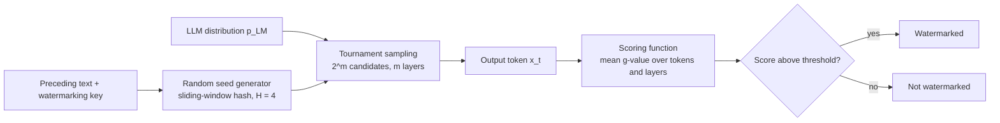

# TextSus — Scalable Watermarking for Identifying LLM Outputs

An implementation and evaluation study of **SynthID-Text**, the generative text-watermarking scheme described in:

> Dathathri, S., See, A., Ghaisas, S. et al. **Scalable watermarking for identifying large language model outputs.** *Nature* 634, 818–823 (2024). https://doi.org/10.1038/s41586-024-08025-4

Large language models now produce text that is hard to tell apart from human writing. SynthID-Text embeds a statistical watermark *during generation* by changing only the next-token sampling step (**Tournament sampling**), so the text can later be identified without access to the LLM itself. This project re-implements the core pipeline, reproduces the paper's main experiments at a smaller scale, and documents the method end to end.

---

## Table of contents

1. [Project goals](#project-goals)
2. [How SynthID-Text works (short version)](#how-synthid-text-works-short-version)
3. [Repository structure](#repository-structure)
4. [Team and responsibilities](#team-and-responsibilities)
5. [Getting started](#getting-started)
6. [Usage](#usage)
7. [Experiments](#experiments)
8. [Results](#results)
9. [Roadmap](#roadmap)
10. [Team workflow](#team-workflow)
11. [References](#references)

---

## Project goals

- Explain why LLM output identification is needed and where watermarking fits among retrieval-based, post-hoc and edit/data-driven approaches.
- Implement the generative watermarking framework: **random seed generator → sampling algorithm → scoring function**.
- Implement **Tournament sampling** (single-layer and multilayer, non-distortionary and distortionary variants) and the g-value machinery behind it.
- Implement watermark **detection** (mean score, weighted mean score, threshold-based decision) that needs only the text and the key, not the LLM.
- Evaluate detectability, text quality, diversity and computational overhead, and compare against baselines (**Gumbel sampling**, **Soft Red List**).
- Discuss limitations: coordination requirements, open-source models, stealing/spoofing/scrubbing, and the effect of editing and paraphrasing.

> **Scope:** the project is restricted to the paper above. Numbers reported by the paper (e.g. the ~20M-response Gemini experiment) are cited, not reproduced; our own experiments run at a smaller scale on public models.

---

## How SynthID-Text works (short version)



1. **Random seed:** a hash of the last `H` tokens and the secret key gives a seed `r_t` at every step.
2. **g-values:** `m` pseudorandom functions `g_1 … g_m` map `(token, seed, layer)` to a value (Bernoulli(0.5) by default).
3. **Tournament sampling:** draw `2^m` candidate tokens from the LLM distribution, then run a knockout tournament where layer `ℓ` keeps the candidate with the higher `g_ℓ` value. The last survivor is the output token.
4. **Detection:** recompute the g-values for a piece of text and take their mean. Watermarked text scores higher; compare with a threshold.
5. **Quality:** with two competitors per match the scheme is *single-token non-distortionary*; repeated context masking extends this to sequences. More competitors give a *distortionary* variant with stronger detectability at some quality cost.

Detectability grows with text length and with the entropy of the LLM distribution.

---

## Repository structure

```
TextSus/
├── README.md
├── LICENSE
├── pyproject.toml              # dependencies and tooling (managed with uv)
├── uv.lock
├── .gitignore
├── configs/                    # YAML configs (model, watermark, experiment settings)
│   ├── default.yaml
│   └── experiments/
├── src/textsus/
│   ├── seed/                   # random seed generator, sliding-window hash, key handling
│   ├── gvalues/                # g-value functions, Bernoulli / Uniform distributions
│   ├── sampling/               # Tournament (single/multilayer), Gumbel, Soft Red List,
│   │                           # repeated context masking
│   ├── scoring/                # mean score, weighted mean, threshold decision
│   ├── generation/             # watermarked text generation with HF models
│   ├── detection/              # detector: text + key -> score -> decision
│   ├── evaluation/             # TPR@FPR, perplexity, Self-BLEU, latency, human-eval stats
│   └── utils/
├── experiments/                # runnable scripts, one per experiment
├── data/                       # ELI5 prompts and generated texts (git-ignored, see data/README.md)
├── results/                    # figures, tables, raw metric files
├── notebooks/                  # exploration and figure notebooks
├── demo/                       # small generate-and-detect demo app
├── tests/                      # unit tests for seeds, g-values, sampling, scoring
├── docs/
│   ├── 01_background/          # Member 1 notes
│   ├── 02_method/              # Member 2 notes
│   └── 03_evaluation/          # Member 3 notes
├── paper/                      # the SynthID-Text paper (PDF)
└── report/                     # final report and presentation slides
```

---

## Team and responsibilities

| Member | Area | Owns | Covers |
|---|---|---|---|
| **Himasai Vihar Suraboina** — _name_ | Background, existing approaches, SynthID-Text framework | `docs/01_background/`, `demo/`, report chapters 1–2 | Why identification is needed; retrieval-based and post-hoc detection and their limits; generative vs edit-based vs data-driven watermarking; seed generator / sampler / scorer framework; SynthID-Text and Tournament sampling overview |
| **Kurri Hiranya Venkata Reddy** — _name_ | Core technical method | `src/textsus/{seed,gvalues,sampling,scoring,detection}/`, `docs/02_method/`, `tests/`, report chapter 3 | Autoregressive generation, top-k / top-p / temperature; keys, sliding-window hashing, pseudorandom functions; g-values; Tournament sampling (candidates, layers, winner selection); scoring and thresholds; non-distortionary vs distortionary variants and the detectability–quality trade-off |
| **Vivek Ediga** — _name_ | Experiments, scalability, results, limitations | `src/textsus/{generation,evaluation}/`, `experiments/`, `results/`, `docs/03_evaluation/`, report chapters 4–5 | Setup (Gemma 2B/7B, Mistral 7B, ELI5); quality evaluation and human studies; SynthID-Text vs Gumbel and Soft Red List; TPR at fixed FPR; latency and vectorized implementation; speculative sampling; limitations, conclusion, future work |

Member 3 depends on the sampling and scoring modules from Member 2, so the interfaces in `src/textsus/` should be agreed early (see [Roadmap](#roadmap)).

---

## Getting started

> Status: scaffold. Commands below describe the intended workflow and will work as modules land.

```bash
git clone https://github.com/Sparrowspidey/TextSus.git
cd TextSus

# install uv once: https://docs.astral.sh/uv/getting-started/installation/
uv sync                            # creates .venv and installs everything from pyproject.toml
uv sync --extra demo               # optional: also install the Streamlit demo dependencies

uv run pytest                      # run tests
uv run python experiments/run_detectability.py
```

Dependencies live in `pyproject.toml` (commit `uv.lock` too so everyone gets identical versions). Add a package with `uv add <package>`, and a dev-only one with `uv add --dev <package>`.

**Models.** The paper uses Gemma 2B-IT, Gemma 7B-IT and Mistral 7B-IT. Gemma requires accepting its licence on Hugging Face and logging in (`huggingface-cli login`). For quick development on limited hardware, any small Hugging Face causal LM can be swapped in through `configs/default.yaml`.

**Data.** Prompts come from `sentence-transformers/eli5` on Hugging Face (a parquet-format
mirror of ELI5 question/answer pairs). The original `eli5` and `eli5_category`
datasets are no longer loadable -- they use loading scripts, which recent
`datasets` library versions dropped support for, and `eli5` itself is defunct
(Reddit locked down the API it depended on).

Regenerate with:
    uv run python experiments/prepare_eli5_data.py --n_dev 200 --n_test 200

Produces:
- eli5_dev.jsonl  — development/prompt-tuning set
- eli5_test.jsonl — held-out test set used for final experiments

Both are git-ignored — regenerate locally rather than committing them.

---

## Usage

Planned interface (names may change as the code is written):

```python
from textsus.generation import WatermarkedGenerator
from textsus.detection import Detector

gen = WatermarkedGenerator(model_name="google/gemma-2b-it", key=12345, num_layers=30)
text = gen.generate("Why is the sky blue?", max_new_tokens=200)

det = Detector(key=12345, num_layers=30)
print(det.score(text))            # mean g-value
print(det.is_watermarked(text))   # threshold decision
```

Run an experiment:

```bash
python experiments/run_detectability.py --config configs/experiments/detectability.yaml
```

---

## Experiments

| Experiment | What it measures | Baseline |
|---|---|---|
| Detectability vs text length | TPR @ FPR = 1% for 50–400 tokens | Gumbel sampling (non-distortionary) |
| Detectability vs temperature / entropy | Effect of temperature 0.5, 0.7, 1.0 | Gumbel sampling |
| Distortionary trade-off | TPR @ FPR = 1% against log-perplexity | Soft Red List |
| Quality and diversity | Perplexity, Self-BLEU, optional small human preference study | Unwatermarked model |
| Layers ablation | Effect of the number of tournament layers `m` | — |
| Latency overhead | ms per token with and without watermarking | Gumbel, Soft Red List |
| Robustness (if time permits) | Detection after editing / paraphrasing | — |
| Speculative sampling (stretch) | Watermark + draft/target model integration | — |

Shared settings follow the paper unless stated otherwise: sliding-window seed with `H = 4`, one-sequence repeated context masking, top-k = 100, Bernoulli(0.5) g-values, `m = 30` layers.

---

## Results

_To be filled in as experiments finish. Figures go in `results/figures/`, tables in `results/tables/`._

---

## Roadmap

- [ ] **Week 1** — Repo scaffold, environment, agreed module interfaces, paper read-through by all members
- [ ] **Week 2** — Seed generator, g-values, single-layer Tournament sampling, unit tests
- [ ] **Week 3** — Multilayer sampling, repeated context masking, scoring and detector, baselines (Gumbel, Soft Red List)
- [ ] **Week 4** — Generation pipeline with a Hugging Face model, first detectability runs
- [ ] **Week 5** — Full experiment suite, latency benchmark, figures
- [ ] **Week 6** — Report, slides, demo, final cleanup

---

## Team workflow

- Work on a feature branch (`member1/...`, `member2/...`, `member3/...`) and open a pull request into `main`; at least one teammate reviews.
- Keep each member's files in their own area where possible to avoid merge conflicts; discuss changes to shared interfaces first.
- Never commit model weights, datasets or API tokens. `data/` and `.env` are git-ignored.
- Add or update tests when changing anything in `src/textsus/seed`, `gvalues`, `sampling` or `scoring`.

---

## References

- Dathathri et al., *Scalable watermarking for identifying large language model outputs*, Nature 2024. Official code: https://github.com/google-deepmind/synthid-text
- Aaronson & Kirchner, *Watermarking of large language models* (Gumbel-style sampling), 2022.
- Kirchenbauer et al., *A watermark for large language models* (Soft Red List), ICML 2023.
- Hu et al., *Unbiased watermark for large language models* (repeated context masking), ICLR 2024.
- Chen et al., *Accelerating large language model decoding with speculative sampling*, 2023.
- Fan et al., *ELI5: long form question answering*, ACL 2019.

## License

Released under the MIT License (see `LICENSE`). The paper is open access under CC BY 4.0.